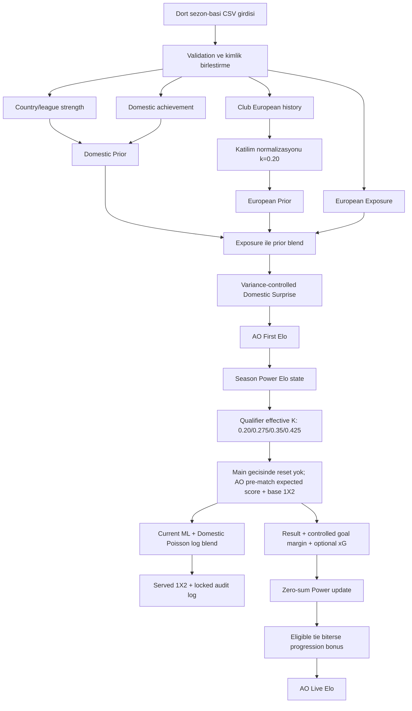

# AO European Elo - Codex Project Context

Son dogrulama tarihi: **2026-08-27**
Aktif model: **`ao-european-elo-v2.0-dev-freeze`**  
Production revision: **`2026-08-27-participation-cup-and-unknown-position`**

Bu belge yeni bir Codex oturumunun projeyi sohbet gecmisine ihtiyac duymadan
anlamasi icin ana giris noktasidir. Formul, veri ve metodoloji ayrintilari alt
belgelere bolunmustur.

## Projenin Amaci

AO European Elo, UEFA kulup turnuvalari icin uc farkli urun uretir:

1. `AO First Elo`: hedef sezon basindaki takim gucu.
2. `AO Live Elo`: maclar ve sezonluk progression bonuslari sonrasindaki guncel
   takim gucu.
3. Current ML ve AO Domestic Poisson'un `%50/%50` log blend'iyle sunulan
   `Home / Draw / Away` mac olasiliklari.

Model aciklanabilir, chronological ve denetlenebilir olacak sekilde tasarlanir.
ML ve skor modelleri rating motoruna otomatik geri beslenmez; production'a
girmeyen calismalar challenger/shadow olarak kalir.

## Otorite Sirasi

Production hakkinda bir celiski goruldugunde su sira izlenir:

1. [`contracts/ao_european_elo_v2_production.json`](contracts/ao_european_elo_v2_production.json)
2. [`src/ao_elo/`](src/ao_elo/) altindaki calisan kaynak kod
3. [`reports/current_model/active_model_snapshot.json`](reports/current_model/active_model_snapshot.json)
4. [`reports/current_model/current_model_evaluation_report.md`](reports/current_model/current_model_evaluation_report.md)
5. [`MODEL_STATUS.md`](MODEL_STATUS.md), README, eski raporlar ve PDF'ler

Research kodunda bulunan sinif veya parametre aktif model kaniti degildir.
Aktivasyon icin production contract ve active config ayni davranisi gostermelidir.

## Aktif Model Hizli Kart

### AO First Elo

| Parametre | Aktif deger |
| --- | ---: |
| Base rating | `500` |
| Referans bandi | `500-2000`, hard cap degil |
| Country benchmark | `25` |
| European history benchmark | `20` |
| European prior katilim normalizasyonu | Aktif, `k = 0.20` |
| Kupa katkisi | Aktif, `w = 0.129032`; kupasizda inert |
| Bilinmeyen lig sirasi | `0.15` = percentile tabani |
| Bes sezon agirligi | `0.07 / 0.13 / 0.20 / 0.27 / 0.33` |
| League strength gamma | `0.80` |
| Domestic league component | `519.9049316696` |
| Domestic achievement component | `594.1770647653` |
| European prior max boost | `1559.7147950089` |
| Effective exposure tavani | `0.65` |
| Country/European/exposure tail beta | `0 / 0 / 0` |
| Domestic Surprise | `theta=0.40`, variance penalty `0.50`, cap `+/-30` |

### AO Live Elo

| Parametre | Aktif deger |
| --- | ---: |
| Elo Scale | `835.5614973262` |
| Global home advantage | `148.5442661913` |
| K | `103.9809863339` |
| Season carry | `0` |
| Qualifier base importance | `Q1 0.40 / Q2 0.55 / Q3 0.70 / QPO 0.85` |
| Qualifier delta retention | `%50`, her macin efektif K degerine gomulu |
| Efektif qualifier K | `Q1 0.20 / Q2 0.275 / Q3 0.35 / QPO 0.425 / Main 1.00` |
| Main entry reset | Yok; mac olmadan Elo degismez |
| Normal draw-at-even | `0.24` |
| Single-match knockout draw-at-even | `0.12` |
| Draw shape | `1.00` |
| Goal difference | `alpha=0.15`, `tau=300`, cap `4` |
| xG performance | ratio `0.30`, scale `1.25` |
| Progression | UCL/UEL/UECL `12/8/4`, cap `48/32/16` |

Aktif Achievement Reserve ve Competition K yoktur. Dynamic K ve team-specific
home advantage kapalıdır. Domestic Poisson + ML tahmin katmanı aktiftir, fakat
prediction-only olduğu için rating state'ini değiştirmez.

### Production 1X2 Prediction

| Parametre | Aktif deger |
| --- | ---: |
| Durum | `PROMOTE_WITH_MONITORING` |
| Ust blend | `%50 Current ML / %50 AO Domestic Poisson` |
| Current ML ic blend | `%10 AO / %90 Structural Logistic` |
| Poisson ic blend | `%50 AO / %50 raw Poisson` |
| Dixon-Coles rho | `0` |
| Fallback | `CURRENT_AO_1X2` |
| AO Live feedback | `false` |
| Monitoring | `2026/27` |
| Domestic state coverage | Checkpoint `312` kimlik denetler, runtime `311` uygun state kullanır; UCL/UEL hedef evreninde `79/80`, União Torreense için takım-bazlı Poisson profili kapalı (`ONE/NONE` güvenli davranış) |

## Hesap Akisi

## Kritik Kavramlar

- `AO First Elo`: sezon basi seed; domestic ve European kanitin kontrollu
  karisimidir.
- `Power Elo`: mac sonucuyla `+Delta/-Delta` degisen sifir-toplamli state.
- `Qualifier retention`: sezonlar arasi carry degildir. Base tur onemi
  `0.40/0.55/0.70/0.85`, `%50` retention ile her mac guncellemesinde
  `0.20/0.275/0.35/0.425` efektif K olur. Ilk ana-asama macindan once reset,
  carry veya mac disi Elo degisimi uygulanmaz.
- `Progression Bonus`: R16 ve sonrasi tamamlanan tie kazananina verilen,
  winner-only ve sezonluk ek deger.
- `Achievement Reserve`: kod yuzeyinde geriye uyumluluk icin bulunur ama aktif
  contract'ta sifirdir.
- `AO Live Elo`: Power + Reserve + Progression toplamidir.
- `E_home`: ev sahibinin beklenen puanidir; dogrudan kazanma olasiligi degildir.
- `1X2`: beklenen puani koruyan ayri beraberlik dagitimiyle uretilir.

## Belge Haritasi

- [`docs/ai/ARCHITECTURE.md`](docs/ai/ARCHITECTURE.md): katmanlar, modul
  sahipligi ve state akisi.
- [`docs/ai/ALGORITHMS.md`](docs/ai/ALGORITHMS.md): hesaplarin adim adim
  algoritmasi ve olay sirasi.
- [`docs/ai/FORMULAS.md`](docs/ai/FORMULAS.md): tum aktif formuller,
  parametreler ve invariantlar.
- [`docs/ai/DATA_CONTRACTS.md`](docs/ai/DATA_CONTRACTS.md): CSV semasi,
  anahtarlar, eksik veri ve zaman sozlesmesi.
- [`docs/ai/LIVE_DATA_INGESTION.md`](docs/ai/LIVE_DATA_INGESTION.md): canli veri
  kaynaklari, cekim zamanlamasi, xG fallback, veritabani ve settlement akisi.
- [`docs/ai/EVALUATION.md`](docs/ai/EVALUATION.md): walk-forward metodolojisi,
  son metrikler ve external validation.
- [`docs/ai/RESEARCH_STATUS.md`](docs/ai/RESEARCH_STATUS.md): aktif, shadow,
  diagnostic ve kapali katmanlar.
- [`docs/ai/RUNBOOK.md`](docs/ai/RUNBOOK.md): komutlar, tekrar uretim ve degisiklik
  kontrol listesi.

## Kaynak Kod Haritasi

| Sorumluluk | Ana modul |
| --- | --- |
| Static config | `src/ao_elo/config.py` |
| Input validation | `src/ao_elo/validators.py` |
| Static feature'lar | `src/ao_elo/features.py` |
| Prior ve blend formulleri | `src/ao_elo/scoring.py` |
| Domestic Surprise | `src/ao_elo/domestic_surprise_variance.py` |
| AO First pipeline | `src/ao_elo/pipeline.py` |
| Dynamic state ve chronology | `src/ao_elo/dynamic.py` |
| Beraberlik/1X2 | `src/ao_elo/draw_probability.py` |
| Gol farki | `src/ao_elo/controlled_live.py` |
| xG guncellemesi | `src/ao_elo/xg_live.py` |
| Progression | `src/ao_elo/tournament_bonus.py` |
| CSV dynamic API | `src/ao_elo/dynamic_csv.py` |
| Production prediction API ve fallback | `src/ao_elo/production_prediction.py` |
| Domestic Poisson state | `src/ao_elo/domestic_poisson.py` |
| Frozen prediction artifact builder | `scripts/build_production_prediction_artifacts.py` |
| Current evaluation | `scripts/run_current_model_evaluation.py` |
| External benchmark (ClubElo + Opta) | `scripts/run_current_external_benchmark.py` |
| Cup achievement challenger | `scripts/run_cup_achievement_backtest.py`, `src/ao_elo/cup_achievement.py` |
| 2026/27 ML feature koprusu | `scripts/build_2026_27_prediction_features.py` |
| 2026/27 sezon seed ve CW veri snapshot'i | `scripts/build_2026_27_preproduction_inputs.py`, `data/season_2026_27_preproduction/domestic_history_audit.csv`, `data/season_2026_27_preproduction/cw_domestic_evidence_audit.csv` |
| Cok sezonlu xG ve katman dogrulamasi | `scripts/run_xg_multiseason_backtest.py`, `data/xg_2020_2026/` |
| xG bilgili gol beklentisi | `src/ao_elo/xg_goal_model.py`, `scripts/run_xg_goal_expectation_backtest.py` |
| xG formu domestic attack/defence uzerinde | `src/ao_elo/xg_domestic_goal_model.py`, `scripts/run_xg_domestic_goal_expectation_backtest.py` |
| Domestic Surprise guclendirme | `src/ao_elo/domestic_surprise_amplification.py`, `scripts/run_domestic_surprise_amplification_backtest.py` |
| European prior katilim normalizasyonu | `src/ao_elo/european_participation.py`, `scripts/run_european_participation_backtest.py` |
| Exposure cap x katilim etkilesimi | `scripts/run_participation_exposure_interaction.py` |
| AO First seed asimetrisi arastirmasi | `src/ao_elo/ao_first_seed_boost.py`, `scripts/run_ao_first_seed_boost_backtest.py` |

## Yeni Bir Gorevde Uygulanacak Protokol

1. `git status --short` ile kullanici degisikliklerini gor.
2. Production contract ve ilgili config constructor'ini karsilastir.
3. Degistirilecek davranisin aktif mi research mu oldugunu yazili olarak
   belirle.
4. Veri penceresini ve leakage sinirini tanimla.
5. Once test/ablation, sonra kullanici onayi, en son production aktivasyonu yap.
6. Model davranisi degisirse contract, unit test, current evaluation ve bu AI
   belge setini birlikte guncelle.

## Bilinen Sinirlar

- 2018/19-2025/26, gelistirme ve tekrarli model secimi penceresidir; saf
  prospective holdout degildir.
- 2026/27 eleme maclari freeze oncesi basladigi icin prospective ledger lig
  asamasi ve sonrasinda kilitlenecektir.
- Cok sezonlu xG kapsami 2020/21-2025/26 doneminde 2.827 uygun maca ulasir.
  Kapsama ana asamada `%98,7`, on elemelerde yalniz `%11` oldugu icin qualifier
  maclarinin buyuk bolumunde goal-margin fallback devam eder.
- Global ev sahibi avantaji sabittir; takim bazli home-context aktif degildir.
- Progression katmaninin pooled loss katkisi pratikte sifira yakindir ve manuel
  urun karariyla aktiftir.
- 2026/27 seed verisinde yerel pozisyon ve takim sayisi, katilimi belirleyen son
  tamamlanmis domestic sezondan gelir. `CW` rotasi eski sezon tablosuna fallback
  yapamaz; bulunamayan takim `N/A` ve acik audit status'u ile tutulur.
