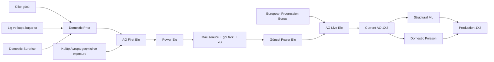

# AO European Elo

AO European Elo, UEFA kulüp turnuvaları için takım gücü ve maç olasılığı
üreten açıklanabilir bir modeldir. Sistem üç ana çıktı verir:

1. **AO First Elo:** Sezon başındaki takım gücü.
2. **AO Live Elo:** Maçlar ve Avrupa'da tur geçişleri sonrasında güncellenen güç.
3. **Production 1X2:** Ev sahibi galibiyeti, beraberlik ve deplasman galibiyeti
   olasılıkları.

Aktif rating sürümü `ao-european-elo-v2.0-dev-freeze`, aktif tahmin sürümü
`ao-ml-poisson-ensemble-v1-production`dır. Tahmin katmanı
`PROMOTE_WITH_MONITORING` durumundadır ve 2026/27 sezonunda Current AO
olasılıklarına karşı izlenir.

> Production davranışının teknik otoritesi
> [`contracts/ao_european_elo_v2_production.json`](contracts/ao_european_elo_v2_production.json)
> dosyasıdır. Eski deney çıktıları veya raporlar bu sözleşmenin önüne geçmez.

## Modelin Akışı



Önemli ayrım:

- Gol farkı, xG ve progression **AO Live Elo'yu etkiler**.
- Structural ML ve Domestic Poisson **yalnız 1X2 olasılığını etkiler**.
- Production tahmini AO First veya AO Live Elo'ya geri beslenmez.

## 1. AO First Elo

AO First Elo, hedef sezon başlamadan önce dört CSV'den üretilir:

```text
teams.csv
country_coefficients.csv
domestic_context.csv
club_european_points.csv
```

Beş sezonluk tüm sinyallerde eskiden yeniye aynı ağırlıklar kullanılır:

```text
0.07, 0.13, 0.20, 0.27, 0.33
```

`t`, hedef sezondan önce tamamlanan en son sezondur. Hedef sezonun sonucu
başlangıç ratingine giremez.

### 1.1 Ülke ve Lig Gücü

UEFA ülke puanı takımın kendi başarısı değil, geldiği ligin Avrupa seviyesidir.

```text
Weighted Country Score = sum(w_i * country_points_i)

u_country = log(1 + Weighted Country Score) / log(1 + 25)
Country Norm = min(u_country, 1)
League Strength = Country Norm ^ 0.80
```

Aktif `country_tail_beta=0` olduğu için benchmark üzerindeki değerler `1`de
doyar. Ham değer audit kolonunda korunur.

### 1.2 Yerel Lig ve Kupa Başarısı

Bilinen lig sırası doğrudan lig yüzdeliğine çevrilir:

```text
Position Percentile = (League Team Count - Position) / (League Team Count - 1)
League Finish Score = 0.15 + 0.70 * Position Percentile
```

Ek kurallar:

| Durum | Değer |
| --- | ---: |
| Lig şampiyonu | En az `1.00` |
| Lig sırası bilinmiyor | `0.10` |
| Kupa şampiyonu | `0.62` |
| Gerçek lig + kupa dublesi | `0.08 * League Finish Score` |
| Achievement güvenlik tavanı | `1.10` |

Yalnız kupa kazanan takım duble bonusu almaz. Şampiyonluk bilgisi ile lig
sırası çelişemez.

```text
Achievement Scale = 0.40 + 0.60 * League Strength

Domestic Prior =
    500
    + 519.9049316696 * League Strength
    + 594.1770647653 * Domestic Achievement * Achievement Scale
```

Bu yapı aynı yerel başarının güçlü bir ligde daha fazla kanıt taşımasını sağlar.

### 1.3 Domestic Surprise

Domestic Surprise, takımın güncel lig performansını kendi son beş sezonluk
normal seviyesine göre değerlendirir. Beş tam sezon yoksa etkisi sıfırdır.

```text
Historical Mean = sum(w_i * Historical Position Percentile_i)
Weighted Volatility = weighted standard deviation
Normalized Volatility = min(1, 2 * Weighted Volatility)
Consistency = 1 - 0.50 * Normalized Volatility

Raw Surprise = Current Position Percentile - Historical Mean
Effective Surprise = Raw Surprise * Consistency

Domestic Adjustment = clip(
    594.1770647653 * Achievement Scale * 0.40 * Effective Surprise,
    -30,
    +30
)
```

Pozitif sürpriz ratingi artırır, negatif sürpriz azaltır. Varyans yönü
değiştirmez; geçmiş sıralaması istikrarsız takımlarda etkinin güvenini azaltır.

### 1.4 Kulübün Avrupa Geçmişi

Kulübün kendi beş sezonluk Avrupa puanı ülke puanından ayrı hesaplanır:

```text
Weighted European History = sum(w_i * club_points_i)
u_europe = log(1 + Weighted European History) / log(1 + 20)
European History Norm = min(u_europe, 1)

European Prior = 500 + 1559.7147950089 * European History Norm
```

Aktif `european_tail_beta=0`dır. Avrupa geçmişi olmayan takımın history satırı
atlanmaz; beş sezon açıkça sıfır yazılır.

### 1.5 European Exposure

Exposure, Avrupa geçmişinin ne kadar güvenilir olduğunu ölçer. Puanın
büyüklüğünden farklıdır; sezon ve maç sayısı kanıtını birleştirir.

```text
Season Exposure = sum(w_i * played_i)
Match Exposure  = sum(w_i * min(1, matches_i / match_cap_i))

European Exposure = 0.60 * Season Exposure + 0.40 * Match Exposure
Effective Exposure = min(European Exposure, 0.85)
```

`0.85` tavanı, Avrupa geçmişi çok güçlü olsa bile Domestic Prior'ın en az
%15'inin final ratingde kalmasını sağlar.

### 1.6 Nihai Başlangıç Ratingi

```text
Adjusted Domestic Prior = Domestic Prior + Domestic Adjustment

AO First Elo =
    Adjusted Domestic Prior
    + Effective Exposure
      * (European Prior - Adjusted Domestic Prior)
```

Domestic Surprise'ın AO First üzerindeki gerçek etkisi:

```text
(1 - Effective Exposure) * Domestic Adjustment
```

Bu nedenle Avrupa kanıtı yüksek takımlarda yerel sürpriz etkisi otomatik olarak
küçülür. Exposure sıfırsa takım doğrudan Adjusted Domestic Prior ile başlar.

`500-2000` bir referans ölçeğidir, hard cap değildir. Ratingler maçlarla
`500` altına veya `2000` üstüne çıkabilir; hesap sonunda clipping yapılmaz.

## 2. AO Live Elo

Sezon başında:

```text
Power Elo = AO First Elo
Power Carry = 0
Progression Bonus = 0
Achievement Reserve = 0
```

### 2.1 Beklenen Sonuç

```text
D = Home AO Live Elo - Away AO Live Elo + H
E_home = 1 / (1 + 10 ^ (-D / Scale))

Scale = 835.5614973262
H     = 148.5442661913
K     = 103.9809863339
```

`H`, normal saha maçında yalnız hesap sırasında kullanılan geçici ev sahibi
avantajıdır; ev sahibinin kalıcı ratingine eklenmez. Nötr sahada `H=0`dır.

Gerçek saha sonucu:

```text
Galibiyet = 1
Beraberlik = 0.5
Mağlubiyet = 0
```

Temel güncelleme:

```text
Base Residual = S_home - E_home
Base Delta = K * Base Residual
```

### 2.2 Kontrollü Gol Farkı

Tek farklı galibiyet normal Elo güncellemesini kullanır. Daha büyük farklarda
bonus artar, ancak güç farkı büyüdükçe sönümlenir:

```text
M_GD = 1 + 0.15 * ln(min(GD, 4)) * exp(-abs(D) / 300)
GD Residual = Base Residual * M_GD
```

- `GD=0` veya `GD=1` için çarpan `1`dir.
- Gol farkı `4`te tavanlanır.
- Penaltı atışları gol farkı bonusu üretmez.
- Favorinin farklı galibiyeti, denk takımlar arasındaki aynı skordan daha az
  ek sinyal üretir.

### 2.3 xG Performans Düzeltmesi

İki takım için de zaman kapsamı doğrulanmış xG varsa:

```text
Q_xG = tanh((xG_home - xG_away) / 1.25)
Residual_xG = 0.30 * abs(Base Residual) * Q_xG

Final Residual = GD Residual + Residual_xG
Power Delta = K * Final Residual
```

xG, kazananın aldığı temel Elo'yu iptal etmez; aldığı puanı performans kanıtına
göre azaltır veya güçlendirir. Analitik yön koruması kazananın temel
kazanımının en az `%70`ini korur.

- Beraberlikte xG düzeltmesi uygulanmaz.
- Penaltıyla karara bağlanan maçta xG düzeltmesi uygulanmaz.
- İki taraflı uygun xG yoksa model kontrollü gol farkı güncellemesine döner.
- Shootout golleri skor veya xG toplamına eklenmez.

Power güncellemesi her maçta sıfır toplamlıdır:

```text
Home Power New = Home Power Old + Power Delta
Away Power New = Away Power Old - Power Delta
```

### 2.4 Penaltı ve Uzatma

`home_goals` ve `away_goals`, 90 dakika veya uzatma oynandıysa 120 dakika saha
skorudur. Penaltı atışları bu skora eklenmez.

Penaltıya giden ikinci ayak saha skorunda `2-0` bittiyse bu maç Power Elo için
galibiyettir. `decided_on_penalties=true` yalnız gol farkı ve xG ek sinyallerini
kapatır. Saha skoru berabere ise `S=0.5` kalır.

## 3. European Progression Bonus

Eleme eşleşmesi tamamen bittiğinde turu geçen takıma sezonluk bonus verilir:

| Tamamlanan aşama | UCL | UEL | UECL |
| --- | ---: | ---: | ---: |
| Son 16 | `+12` | `+8` | `+4` |
| Çeyrek final | `+12` | `+8` | `+4` |
| Yarı final | `+12` | `+8` | `+4` |
| Final / şampiyonluk | `+12` | `+8` | `+4` |
| Sezonluk tavan | `48` | `32` | `16` |

Kurallar:

- Knockout play-off, ön elemeler, lig aşaması ve ilk 8 bonus üretmez.
- Bonus aynı `tie_id` için yalnız bir kez uygulanır.
- Kaybedenden puan düşülmez.
- Penaltıyla tur geçen takım progression bonusunu alır.
- Bonus yeni sezona taşınmaz.
- Achievement Reserve aktif değildir ve değeri sıfırdır.

Kullanıcıya gösterilen tek canlı rating:

```text
AO Live Elo = Power Elo + Progression Bonus
```

Progression winner-only olduğu için AO Live toplamı korunmak zorunda değildir;
sıfır-toplam garantisi yalnız Power Elo için geçerlidir.

## 4. Maç Olasılıkları

### 4.1 Current AO 1X2

`E_home` doğrudan galibiyet olasılığı değildir; beklenen maç puanıdır.
Beraberlik katmanı bunu üç sınıfa ayırır:

```text
P_draw = d * (4 * E_home * (1 - E_home)) ^ 1.00
P_home = E_home - 0.5 * P_draw
P_away = 1 - E_home - 0.5 * P_draw
```

| Maç formatı | `d` |
| --- | ---: |
| Normal veya iki ayaklı maç | `0.24` |
| Tek maçta tamamlanan eleme | `0.12` |

`is_single_match_tie` sonuçtan değil, fikstür formatından gelmelidir. Üç
olasılık toplamı `1`dir ve beklenen puan kimliği korunur:

```text
P_home + 0.5 * P_draw = E_home
```

### 4.2 Production ML + Poisson Tahmini

Web sitesine sunulan nihai 1X2, iki prediction-only bileşenin log-probability
uzayında birleşimidir.

```text
Current ML = LogBlend(Current AO, Structural Logistic, ML weight=0.90)

AO Poisson = LogBlend(Current AO, Domestic Poisson rho=0,
                      Poisson weight=0.50)

Production 1X2 = LogBlend(Current ML, AO Poisson,
                          AO Poisson weight=0.50)
```

`LogBlend(A, B, w)` işlemi her sınıf için `A^(1-w) * B^w` hesaplar ve sonucu
toplamı `1` olacak biçimde normalize eder.

#### Structural Logistic

Model, yalnız maçtan önce bilinen şu feature gruplarını kullanır:

- Current AO log-odds ve beklenen skor,
- AO First/Live rating farkları ve European Exposure,
- UCL/UEL/UECL, aşama, tur, leg ve tek/çift maç formatı,
- daha önce oynanmış Avrupa maçlarından kısa ve orta dönem form,
- gol atma/yeme eğilimleri,
- dinlenme günü ve son 14/30 gündeki maç yoğunluğu,
- eşleşmenin maç öncesi aggregate durumu.

Hedef maçın sonucu, skoru veya maç sonrası ratingi feature değildir.

#### Domestic Poisson

Yerel lig katmanı, `45.423` maç, `19` lig ve `508` kaynak takım üzerinde
takım hücum/savunma profilleri öğrenmiştir. `171` kulüp AO kimliğine güvenle
eşlenmiştir.

Aktif yerel state parametreleri:

| Parametre | Değer |
| --- | ---: |
| Team learning rate | `0.02` |
| Season carry | `0.90` |
| Reliability shrinkage | `10` maç |
| Team venue context | Kapalı |
| Lambda aralığı | `0.20-4.50` |

Avrupa transfer parametreleri:

| Parametre | Değer |
| --- | ---: |
| `mu` | `0.2804007979` |
| Elo slope | `0.6663036965` |
| Attack coefficient | `0.0920974542` |
| Defence coefficient | `0.0606564817` |
| Venue coefficient | `0` |
| L2 | `10` |
| Dixon-Coles `rho` | `0` |

Yerel geçmişi olmayan maçta Poisson bileşeni Current AO'ya döner. Artifact,
feature veya state hatasında tüm production satırı Current AO 1X2 fallback'i
olarak loglanır. Tahmin katmanı hiçbir durumda rating state'ini değiştirmez.

## 5. Aktif Parametre Özeti

| Katman | Aktif değer |
| --- | --- |
| Model ölçeği | `500-2000` referans, clipping yok |
| Sezon ağırlıkları | `0.07 / 0.13 / 0.20 / 0.27 / 0.33` |
| Country benchmark / gamma / tail | `25 / 0.80 / 0` |
| European benchmark / tail | `20 / 0` |
| Exposure birleşimi | `%60 sezon + %40 maç` |
| Effective exposure tavanı | `0.85` |
| Domestic Surprise | `0.40`, variance penalty `0.50`, cap `+/-30` |
| Dynamic Scale / H / K | `835.5615 / 148.5443 / 103.9810` |
| Power carry | `0` |
| Beraberlik | `0.24`, tek maç `0.12`, shape `1.00` |
| Gol farkı | `alpha=0.15`, `tau=300`, cap `4` |
| xG | ratio `0.30`, scale `1.25`, minimum ratio `0.70` |
| Progression | `12/8/4`, cap `48/32/16`, dört aşama |
| Achievement Reserve | Kapalı |
| Competition K | Kapalı; tüm turnuvalarda `1.0` |
| Production tahmini | `%50 Current ML + %50 AO Poisson rho=0` |
| Rating feedback | Kapalı |
| Fallback | `CURRENT_AO_1X2` |

## 6. Güncel Performans

Rating çekirdeği `2018/19-2025/26` geliştirme penceresindeki `4.884` unseen
Avrupa maçında değerlendirilmiştir:

| Model | Brier | Log-loss | Accuracy | Spearman | Pairwise |
| --- | ---: | ---: | ---: | ---: | ---: |
| Reference core | `0.573699` | `0.967369` | `0.547297` | `0.668059` | `0.752024` |
| Current AO rating core | `0.572093` | `0.964371` | `0.550164` | `0.672160` | `0.753519` |

Production tahmin katmanı aynı unseen maçlarda:

| Tahmin | Brier | Log-loss | Accuracy |
| --- | ---: | ---: | ---: |
| Current AO 1X2 | `0.572093` | `0.964371` | `0.550164` |
| Current ML | `0.568690` | `0.960458` | `0.552007` |
| AO Poisson | `0.569044` | `0.960298` | `0.553235` |
| Production ML + Poisson | **`0.568093`** | **`0.959242`** | **`0.553849`** |

Production ensemble'ın Current AO'ya farkı:

```text
Brier     -0.003999
Log-loss  -0.005129
Accuracy  +0.003686
```

Bu sonuçlar geliştirme dönemi walk-forward kanıtıdır; bağımsız 2026/27
prospective izleme yerine geçmez.

Ana raporlar:

- [`reports/current_model/current_model_evaluation_report.md`](reports/current_model/current_model_evaluation_report.md)
- [`reports/production_prediction/backtest_report.md`](reports/production_prediction/backtest_report.md)
- [`reports/production_prediction/model_comparison.csv`](reports/production_prediction/model_comparison.csv)

## 7. Aktif Olmayan Araştırmalar

Repository'de çok sayıda araştırma modülü bulunur. Bir modülün kodda bulunması
production'da aktif olduğu anlamına gelmez.

| Katman | Durum |
| --- | --- |
| Dynamic K | Reddedildi; aktif K sabit |
| UCL/UEL/UECL normal maç K çarpanı | Kapalı |
| Season Power Carry | Kapalı |
| Achievement Reserve | Kapalı |
| Team-specific home advantage | Shadow |
| Draw shape `0.84` | Shadow; aktif shape `1.00` |
| Stage-weighted progression | Reddedildi |
| Q1-Q5 / Q1-Q3 rakip profili | Diagnostic |
| Domestic Surprise MOB | Diagnostic |
| Scoreline Poisson/Dixon-Coles | Diagnostic |

Tam durum listesi:
[`docs/ai/RESEARCH_STATUS.md`](docs/ai/RESEARCH_STATUS.md).

## 8. Veri Sözleşmesi

### Sezon başı zorunlu veriler

| Dosya | Ana içerik |
| --- | --- |
| `teams.csv` | Kalıcı `team_id`, takım, ülke ve yerel lig |
| `country_coefficients.csv` | Son beş tamamlanmış sezonun UEFA ülke puanları |
| `domestic_context.csv` | Lig sırası, lig takım sayısı, şampiyonluk, kupa ve son beş lig sırası |
| `club_european_points.csv` | Kulüp Avrupa puanı, oynanan sezon ve maç sayısı |

### Canlı maç zorunlu verileri

```text
match_id, season, kickoff_utc, competition, round, stage, tie_id,
home_team_id, away_team_id, is_neutral, is_single_match_tie,
home_goals, away_goals, decided_on_penalties, advanced_team_id
```

xG opsiyoneldir ancak kullanılacaksa iki taraflı, aynı zaman kapsamına sahip ve
penaltı atışlarından arındırılmış olmalıdır. Eksik xG sıfır yazılmaz.

Production veri sözleşmesinin tamamı:
[`docs/ai/DATA_CONTRACTS.md`](docs/ai/DATA_CONTRACTS.md).

Canlı veri toplama ve işlem sırası:
[`docs/ai/LIVE_DATA_INGESTION.md`](docs/ai/LIVE_DATA_INGESTION.md).

## 9. Kurulum

```bash
git clone https://github.com/EtkaCandemir/AkilOyunuElo.git
cd AkilOyunuElo
python3 -m venv .venv
source .venv/bin/activate
python3 -m pip install -r requirements.txt
export PYTHONPATH="$PWD/src"
```

API anahtarları ve diğer secret değerler repository'ye yazılmaz. Environment
variable veya sistem keychain kullanılır.

## 10. Hızlı Başlangıç

### Testler

```bash
python3 -m pytest -q
```

### V2 pilotları

```bash
python3 scripts/run_v2_pilots.py
```

### AO First Elo üretimi

```bash
mkdir -p output/my_season
```

```python
from ao_elo import AOEuropeanEloConfig, compute_ao_first_elo_from_csv

ratings = compute_ao_first_elo_from_csv(
    teams_csv="data/my_season/teams.csv",
    country_coefficients_csv="data/my_season/country_coefficients.csv",
    domestic_context_csv="data/my_season/domestic_context.csv",
    club_european_points_csv="data/my_season/club_european_points.csv",
    config=AOEuropeanEloConfig.active(),
    output_csv="output/my_season/ao_first_elo.csv",
)
```

### Sezon replay'i

```bash
python3 scripts/run_dynamic_elo.py \
  --initial-ratings output/my_season/ao_first_elo.csv \
  --matches data/my_season/matches.csv \
  --output-dir output/my_season/replay
```

### Production 1X2 tahmini

```bash
python3 scripts/run_production_prediction.py \
  --features path/to/pre_match_features.csv \
  --generated-at-utc 2026-09-01T16:00:00Z \
  --output path/to/pre_match_prediction_log.csv \
  --strict-artifacts
```

Prediction her zaman kickoff'tan önce kilitlenmelidir. Artifact veya feature
uyuşmazlığında `--strict-artifacts` işlemi durdurur; servis modundaki satır bazlı
hatalar Current AO fallback'i olarak loglanır.

### Güncel değerlendirmeyi yeniden üretme

```bash
python3 scripts/run_current_model_evaluation.py --bootstrap-samples 4000
```

## 11. Proje Yapısı

```text
src/ao_elo/                  Model ve production runtime kodu
contracts/                   Aktif production sözleşmesi
artifacts/production_prediction/
                             Checksum'lu ML modeli ve Poisson state'i
scripts/                     Pilot, replay, backtest ve batch CLI'ları
tests/                       Unit, regression ve invariant testleri
data/                        Küçük fixture/pilot ve veri sözleşmeleri
reports/                     Git'te tutulan özet kanıt paketleri
docs/ai/                     Mimari, formül, veri ve işletim belgeleri
output/                      Yeniden üretilebilir yerel çıktılar; Git'e girmez
```

## 12. Belge Haritası

| İhtiyaç | Belge |
| --- | --- |
| Sistem mimarisi | [`docs/ai/ARCHITECTURE.md`](docs/ai/ARCHITECTURE.md) |
| Formüller | [`docs/ai/FORMULAS.md`](docs/ai/FORMULAS.md) |
| Algoritmalar | [`docs/ai/ALGORITHMS.md`](docs/ai/ALGORITHMS.md) |
| Veri kolonları | [`docs/ai/DATA_CONTRACTS.md`](docs/ai/DATA_CONTRACTS.md) |
| Canlı veri akışı | [`docs/ai/LIVE_DATA_INGESTION.md`](docs/ai/LIVE_DATA_INGESTION.md) |
| Test ve metrikler | [`docs/ai/EVALUATION.md`](docs/ai/EVALUATION.md) |
| Aktif/shadow/rejected durumu | [`docs/ai/RESEARCH_STATUS.md`](docs/ai/RESEARCH_STATUS.md) |
| Çalıştırma adımları | [`docs/ai/RUNBOOK.md`](docs/ai/RUNBOOK.md) |

Sunum ve paylaşım için güncel PDF seti:

| Belge | PDF |
| --- | --- |
| Tam teknik model açıklaması | [`docs/pdf/AkilOyunu_Elo_Model_Aciklayici.pdf`](docs/pdf/AkilOyunu_Elo_Model_Aciklayici.pdf) |
| Kısa model açıklaması | [`docs/pdf/AkilOyunu_Elo_Model_Kisa.pdf`](docs/pdf/AkilOyunu_Elo_Model_Kisa.pdf) |
| Geliştirme ve production izleme planı | [`docs/pdf/AkilOyunu_Elo_Onaylanan_Gelistirme_Plani.pdf`](docs/pdf/AkilOyunu_Elo_Onaylanan_Gelistirme_Plani.pdf) |
| Veri ihtiyaçları ve anlamlandırma | [`docs/pdf/AkilOyunu_VeriAnlamlandirma.pdf`](docs/pdf/AkilOyunu_VeriAnlamlandirma.pdf) |

## 13. Temel Güvenlik Kuralları

- `team_id`, sezonlar boyunca kalıcı olmalıdır.
- Duplicate takım, sezon, maç veya `tie_id` olayı sessizce kabul edilmez.
- Maçlar kesin UTC ve `match_id` sırasıyla işlenir.
- Aynı anda başlayan maçlar sonuç sızıntısını önleyen aynı pre-match snapshot'ı
  kullanır.
- Gelecek maç sonucu, xG veya maç sonrası rating pre-match feature'a giremez.
- Power Elo her maçta sıfır toplamlıdır.
- xG yokluğu sıfır performans olarak yorumlanmaz; fallback uygulanır.
- Production artifact ve contract SHA-256 değerleri startup'ta doğrulanır.
- `output/`, provider cache'leri, API anahtarları ve büyük ham veri Git'e
  eklenmez.

## Lisans

Bu repository için henüz açık kaynak lisansı tanımlanmamıştır. Kodun yeniden
kullanım koşulları proje sahibi tarafından ayrıca belirlenmelidir.
